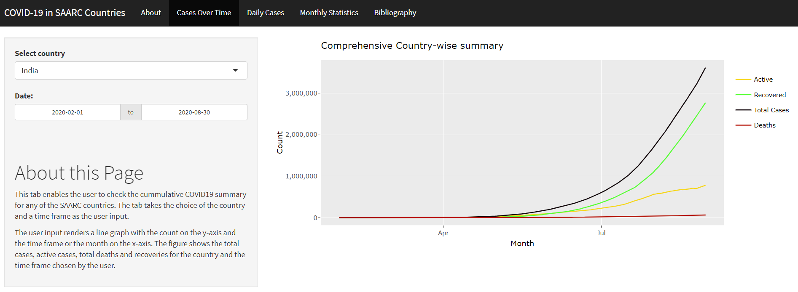

# covidasia
<!-- badges: start -->
<!-- badges: end -->

The goal of _covidasia_ package is to run an app **Covid-19 in SAARC countries** made using shiny to provide a detailed summary of COVID-19 implications on major Asian countires.

The app is made to assess and compare the spread of corona virus in major Asian countries. The countries included are India, Pakistan, China, Bangladesh, Nepal, Srilanka and Maldives. The app consists of three separate tabs which explain the cumulative, current and also provides a statistical summary of the situation of the virus in these countries.

## Installation

You can install the  _covidasia_ package with:

``` r
# install.packages("devtools")
devtools::install_github("etc5523-2020/r-package-assessment-Siddhant-96
")
```
## Attributes

The covidasia app is useful to understand the cumulative, current and also provides a statistical summary of the situation of the virus in major asian countries. It's **three** main attributes are :

- **Cases over time** - This tab provides the cumulative COVID19 summary for any of the countries.

- **Daily cases** - This tab provides the daily COVID19 impact for all of the countries together for better differentiation. 
- **Monthly statistics** - This tab provides the monthly effects of COVID19 on major Asian countries.

## Example

Below mentioned R chunk is used to launch the app.

``` r
library(covidasia)
launch_app()
```
Below is a preview of the app.



Below is a preview of the dataset.

``` r
asia_filter
# A tibble: 1,883 x 16
# Groups:   id [7]
   id    date       tests administrative_~ confirmed deaths recovered Daily_Cases Daily_Deaths Daily_Recoveries cancel_events
   <chr> <date>     <int> <chr>                <int>  <int>     <int>       <int>        <int>            <int>         <int>
 1 BGD   2020-01-25    NA Bangladesh              NA     NA        NA          NA           NA               NA             0
 2 BGD   2020-01-26    NA Bangladesh              NA     NA        NA          NA           NA               NA             0
 3 BGD   2020-01-27    NA Bangladesh              NA     NA        NA          NA           NA               NA             0
 4 BGD   2020-01-28    NA Bangladesh              NA     NA        NA          NA           NA               NA             0
 5 BGD   2020-01-29    NA Bangladesh              NA     NA        NA          NA           NA               NA             0
 6 BGD   2020-01-30    NA Bangladesh              NA     NA        NA          NA           NA               NA             0
 7 BGD   2020-01-31    NA Bangladesh              NA     NA        NA          NA           NA               NA             0
 8 BGD   2020-02-01    NA Bangladesh              NA     NA        NA          NA           NA               NA             0
 9 BGD   2020-02-02    NA Bangladesh              NA     NA        NA          NA           NA               NA             0
10 BGD   2020-02-03    NA Bangladesh              NA     NA        NA          NA           NA               NA             0
# ... with 1,873 more rows, and 5 more variables: stay_home_restrictions <int>, international_movement_restrictions <int>,
#   contact_tracing <int>, stringency_index <dbl>, active_cases <int>
```

